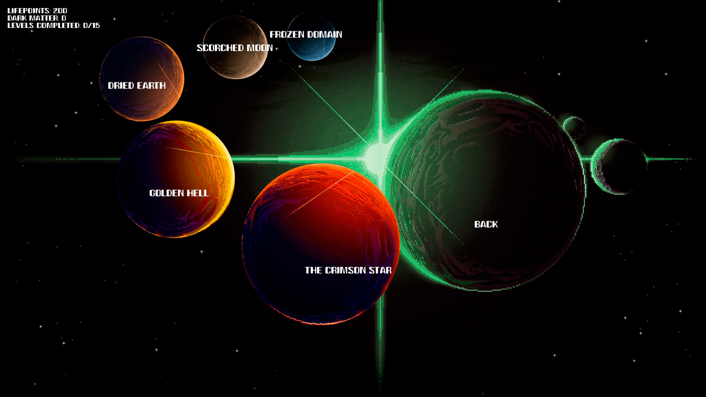
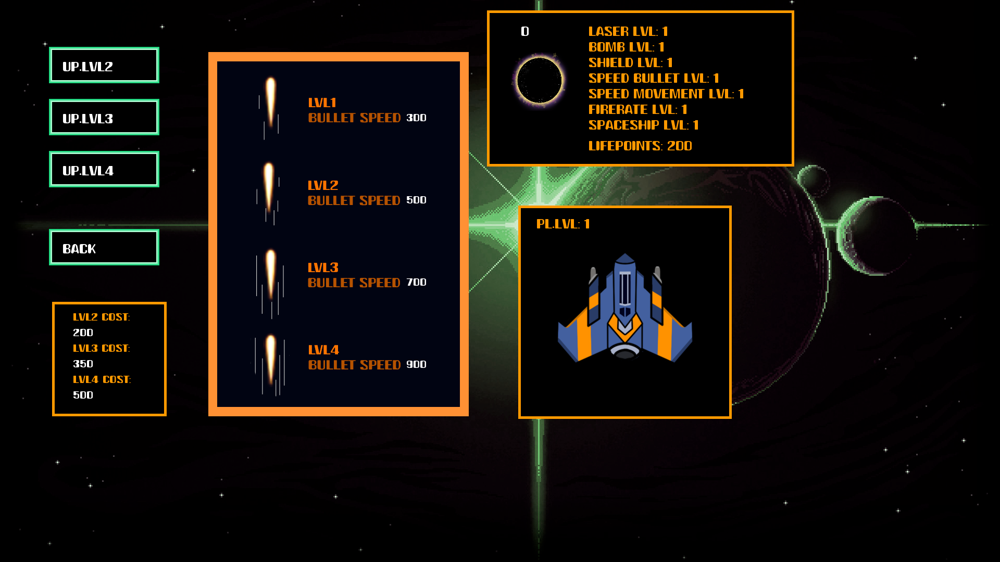
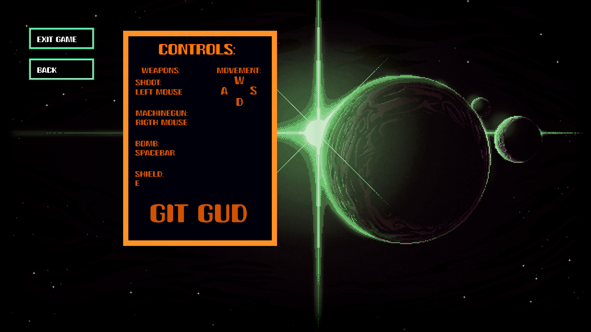
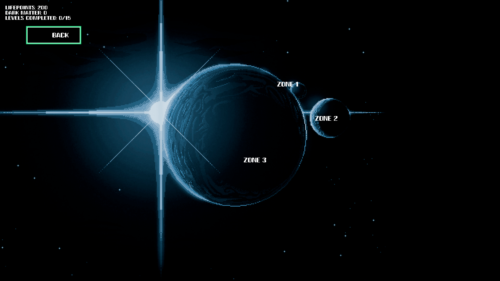
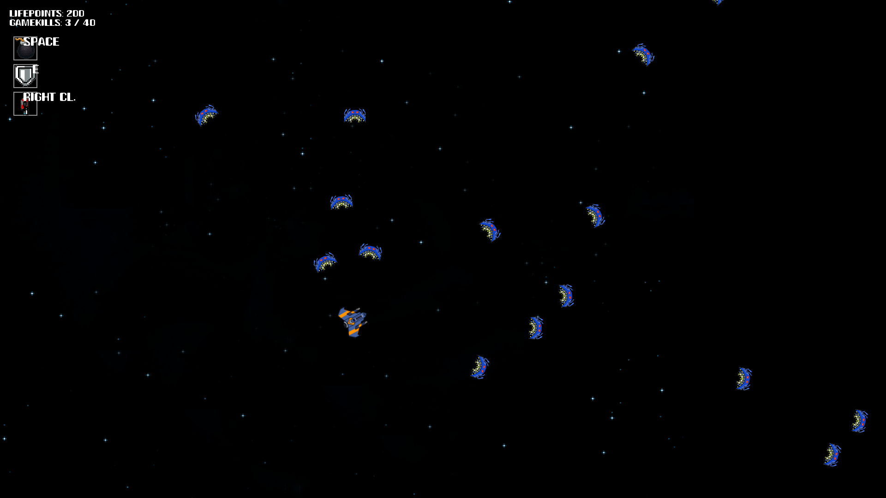

# Aeternum

> My first complete game, built in Love2D / Lua. A top-down shooter with 15 levels across 5 planets, an upgrade system and a shop. The **original game** is uploaded exactly as I left it when I finished it in 2023, with no later refactoring, an honest snapshot of where I was as a developer back then. The things I added years later are an **online leaderboard** and a **local co-op mode**, kept separate and documented in [their](#online-leaderboard-added-in-2026) [own](#local-co-op-added-in-2026) sections.

<p align="center">
  <a href="https://youtu.be/rTFi5HzEdAk?si=Oq6bFmgcYhf6JiBt">
    
  </a>
</p>

<p align="center">
  
  
  
  
  
</p>

<p align="center">
  <strong><a href="https://YOUR-ITCH-USERNAME.itch.io/aeternum">Download and play on itch.io (Windows, no setup)</a></strong>
</p>

## About this repository

Aeternum is the first serious project I ever finished as a developer. I built it over 2-3 weeks, finishing it in November 2023, with significant help from AI in many places, and with no prior programming experience. It has bugs, design choices I wouldn't make today, and patterns I'd factor out in a heartbeat. **The original game is uploaded exactly as it was**, untouched after the fact, because this repo isn't meant to showcase "clean code." It's meant to show two things:

- that I was able to ship a complete, playable game with menus, progression, balancing and audio,
- and that today I can look at that code with a critical eye and point to exactly what's wrong with it.

That second part is documented below, in [Known bugs and technical debt](#known-bugs-and-technical-debt) and [What I'd do differently today](#what-id-do-differently-today).

**Two later additions:** in 2026 I came back and bolted networking onto the game, as an exercise in extending an existing codebase. First an [online leaderboard](#online-leaderboard-added-in-2026), which meant adding an HTTP client layer and standing up a separate backend. Then a [local co-op mode](#local-co-op-added-in-2026) for 2 players over the same network, which meant building a small real-time multiplayer layer on top of a game that was never designed for it. Those are the only things touched after 2023, and they did modify a handful of the original files. I've kept them clearly labelled so the 2023 snapshot stays legible, the rest of the game's structure and rough edges are untouched on purpose.

A note on credit: **the code is mine, the art and audio are not**, I used free-to-use assets from other creators. See [Credits](#credits) for details.

## The game

You pilot a ship defending its position against waves of enemies across different planets. Each planet has 3 levels with a different mix of enemy types. With the money earned from kills, you can upgrade your ship in the shop: more health, faster bullets, better fire rate, shields, an area-of-effect bomb, and a temporary "gun" mode.

**Features:**

- 5 planets × 3 levels = **15 stages**
- **6 enemy types** (melee chasers, ranged shooters with homing bullets, etc.)
- **6 independent upgrades** with 4 tiers each: shield, bomb, gun, fire rate, bullet speed, movement speed
- **Power-ups with cooldowns** that you activate mid-fight
- Spatial objects that affect the battlefield (stars, black holes with a telegraph warning before they appear)
- Music and sound effects with toggles
- Complete menu system: planets, shop, options, game over, level cleared
- **Online global leaderboard** (added in 2026) ranked by leftover health, see [its own section](#online-leaderboard-added-in-2026)
- **Local co-op for 2 players** (added in 2026) over the same WiFi network, see [its own section](#local-co-op-added-in-2026)

## Online leaderboard (added in 2026)

The original game was fully offline. Years later, as an exercise in adding networking to an existing codebase, I built a **global online leaderboard**: when you finish all 15 levels, your run is submitted to a server and ranked against everyone else's, ordered by **leftover health**, the more life you finish with, the higher you place. You can browse the global top from the leaderboard menu inside the game.

Wiring it in meant adding a small networking layer to the client and standing up a separate backend, and it did modify a few of the original files (`main.lua`, `others/data.lua`, and the game-over and leaderboard menus). Everything else is left as it was.

**Client side** (in this repo):

- `network/leaderboard.lua`, a small client that talks to the server. HTTP requests run on a separate LÖVE thread (`love.thread`) so a slow or cold-starting server never freezes the game loop. It uses the `https` module bundled with LÖVE 12 and `libs/json.lua` ([rxi/json.lua](https://github.com/rxi/json.lua)) for JSON encoding.
- On finishing the game, the run (name + leftover health + total kills + money) is submitted once, and the leaderboard menu fetches and renders the global top 10, sorted by health.

**Server side** (separate repo): a small **Node.js + Express** API backed by **PostgreSQL** (hosted on **Neon**), deployed for free on **Render**. It exposes two endpoints, one to submit a run and one to read the ranked top N, and stores everything in a single `scores` table. The database connection string lives only as an environment variable on the host, never in the code.

> Heads-up: the leaderboard endpoint is public and unauthenticated, which is fine for a hobby project but means scores aren't verified server-side. It's there for fun, not as a competitive ladder.

## Local co-op (added in 2026)

The second post-2023 addition: a **cooperative mode for 2 players over the same network** (same WiFi, or same PC with two instances). One player hosts from the ONLINE button in the main menu, the other joins by typing the host's local IP, and the full 15-level campaign becomes playable with two ships sharing one pot of dark matter. Both players' names appear together on the run ("HOST & CLIENT"), and if they beat the game, only the host submits to the leaderboard so the run isn't counted twice.

The interesting part is the architecture. Retrofitting multiplayer onto a single-player game is famously painful, so I picked the model that minimizes how much of the original code needs to be aware of the network:

- **Host-authoritative simulation.** The host runs the entire game exactly as in single player: enemy spawns, bullets, collisions, scoring. The client doesn't simulate anything. Each frame it sends only its **input** (movement keys, aim angle, fire/power buttons) to the host, and the host sends back a **snapshot** of the world state, which the client just draws. Because there's only ever one simulation, desync is impossible by construction, there's no state to reconcile.
- **Transport: ENet** (reliable UDP, bundled with LÖVE, `require("enet")`). Snapshots and inputs go unsequenced, every frame, where a dropped packet doesn't matter because the next one supersedes it. Important one-shot events (level start, level end, shop purchases) go on the reliable channel so they're guaranteed and ordered.
- **Shared economy without a server.** Dark matter is synced by broadcasting deltas: when either player spends in the shop, the other side is told to subtract the same amount. The host seeds the shared pot on connect.
- **Clean session boundaries.** Connecting starts a fresh run for both players (progress and upgrades reset), and disconnecting, intentionally or by losing the other player, tears the session down and returns the game to its solo state, as if it had just been opened.

Code-wise it's three new files, plus small hooks in `main.lua` and the planet menus:

- `network/coop.lua`, the transport layer: connection lifecycle, message encoding (JSON over ENet), reliable vs unsequenced sends, ping.
- `network/cooplauncher.lua`, the coordinator: host/join UI, ready-up handshake with loadout exchange, name exchange, shared-money sync, and a debug overlay (F3) with FPS, frame time and ping.
- `planetlevels/coopengine.lua`, a generic engine that can run any of the 15 levels in co-op without duplicating the 15 level files.

> Why LAN-only? Making this "click online and play with anyone over the internet" requires matchmaking plus a relay server running 24/7, which means permanent infrastructure (and a monthly bill) for a portfolio game. I prototyped and tested the internet path over a VPN during development, then deliberately scoped the shipped feature to LAN. If you want to play remotely anyway, a free mesh VPN like Tailscale or Radmin makes both PCs look like they're on the same network, and the game works over it unchanged.

## How to run it

**Easiest, Windows, no setup needed.** Download the ready-to-play build from itch.io, unzip it, and run `Aeternum.exe`. Nothing to install.

**[Download Aeternum on itch.io](https://YOUR-ITCH-USERNAME.itch.io/aeternum)**

**From source (any platform).** You'll need [LÖVE 12](https://love2d.org/) installed (currently distributed as a nightly build; the online leaderboard relies on its bundled `https` module), then run:

```bash
love .
```

Or drag the game folder onto the Love2D executable. A packaged build is also attached to each [GitHub release](../../releases).

**Co-op:** both players run the game on the same network. One clicks ONLINE → Host and shares the local IP shown on screen; the other clicks ONLINE → Join and types it. To try it alone, run two instances on the same PC and join `127.0.0.1`.

## Controls

| Action | Key |
|---|---|
| Move | `W` `A` `S` `D` |
| Aim | Mouse |
| Shoot | Left click |
| Gun mode (temporary) | Right click |
| Shield | `E` |
| Bomb | `Space` |
| Toggle fullscreen | `F` |
| FPS/ping overlay | `F3` |

## Glitches and exploits

These are gameplay-level oddities, different from the code-level issues in [Known bugs and technical debt](#known-bugs-and-technical-debt) below. I'm keeping them collapsed so they don't spoil the game for anyone who wants to play it cold.

<details>
<summary><strong>⚠️ Spoiler warning, don't open if you'd rather discover the game on your own.</strong></summary>

<br>

Things I noticed while playing that affect the experience. I'm splitting them into **glitches** (exploitable design/balance issues) and **bugs** (unintended technical behaviour).

**Glitches, exploits and balance issues**

- **Blackmatter (money) farming via enemy stacking.** The money you earn per level is tied to the number of enemies killed, and the level only ends once you exceed the kill target. That means you can deliberately let enemies pile up and then mass-kill them all at once, earning far more blackmatter than the level was designed to pay out. Stack it with picking up comets (which also reward you) and the income scales even further.
- **Max-level shield is essentially immortality.** At tier 4, the shield combines a long active duration with a very short cooldown between uses. The result: it's up nearly as often as it's down, and you can tank pretty much anything. Definitely a balance miss.

**Bugs, unintended behaviour**

- **Projectiles bleed across levels.** When loading into a new level, you can sometimes find leftover enemy bullets from the previous level still on screen. They weren't destroyed during the transition. (This is the player-visible side of the `Data:resetData()` issue listed in the dev section below.)
- **Off-screen enemy shots.** Because of how the enemy spawner positions hostiles, they can fire at you from outside your visible area, you can take a hit from something you can't even see yet.

If you spot another bug or glitch I haven't listed, **please open an issue**, I'd genuinely love to hear about it.

</details>

## Project structure

```
Aeternum/
├── main.lua                # Main dispatcher
├── conf.lua                # Love2D config
├── bullets/                # Player and per-enemy-type bullets
├── enemies/                # Logic for the 6 enemy types
├── menus/
│   ├── mainmenus/          # Start, main, game over, level cleared, leaderboard, states
│   ├── planetmenus/        # Planet selector and per-planet level selector
│   ├── spaceshipmenus/     # Upgrade shop
│   ├── optionsmenus/       # Options
│   └── drawmenus/          # HUDs and stats
├── audio/                  # AudioManager and audio files
├── others/                 # Global Data, player, collisions, powers
├── planetlevels/           # One file per level, plus coopengine.lua (added 2026)
├── spatialobjects/         # Stars and meteorites
├── network/                # Leaderboard client and co-op networking (added 2026)
└── libs/                   # Third-party libraries (json.lua)
```

The Node/Express + PostgreSQL backend that powers the leaderboard lives in its own separate repository.

## Known bugs and technical debt

I've reviewed this with hindsight. I'm listing them not to make excuses, but to make the point that **I can identify them now**, which is the actual skill that matters. These are all about the original 2023 game.

### Real bugs

- **`Data:resetData()` is empty.** It's called from `states.lua` when entering several planets, but the function body was never implemented. That's why state between runs doesn't fully clean up (HP, player position, counters). This same gap is why the 2026 leaderboard couldn't offer a clean "play again", the game-over screen just exits, because resetting state properly would have meant fixing this first.
- **Inverted comparison in a bullet-vs-bullet collision check.** In `collisions.lua`, the first check between player bullets and `enemy2` bullets uses `>` instead of `<`. Result: your bullets die when they're *far* from enemy2 bullets, not when they collide with them.
- **The "gun" power-up sprites are copy-pasted from the shield.** All three variants (`gunlvl1/2/3sprite`) point to `shieldlvl1.png`.
- **Dirty level state between runs.** Each level caches its `player`, enemy arrays, etc. in module-local variables. Since Lua caches `require`d modules, those locals live forever. The correct fix was the `resetData()` that was left unimplemented. (Amusingly, the 2026 co-op mode had to solve this for real: starting or ending an online session performs the full state reset the original game never did.)
- **`Data.windowWidth/Height` captured before fullscreen kicks in.** Evaluated when `data.lua` loads, before `main.lua` switches to fullscreen. Ends up holding the initial size from `conf.lua` (1450×750) instead of the actual monitor resolution.
- **`Enemy1` has a `self.maxTime = 1 * self.maxTime`** which does nothing. It was probably meant to ramp up difficulty gradually.

### Technical debt / decisions I'd make differently now

- **Massive per-level duplication.** In `playerbullets.lua`, `player.lua` and every enemy file, there's an `if Data.lvl == 1 then ... elseif Data.lvl == 2 then ...` chain repeated up to 15 times. The only thing changing between branches is which `PlanetXlevelY` object gets queried for the angle. A `levels[Data.lvl]` table would collapse ~5 files into a fraction of their current size.
- **`Player:draw()` repeats the same block 15 times** (one per level), and inside each block it repeats the 4 shield/bomb/gun tiers doing almost the same thing. It's a giant pyramid of ifs where one parameterized block would do.
- **`AudioManager.new()` is called from ~25 modules**, loading the same audio files once per module. It should be a singleton.
- **`math.randomseed(os.time())` repeated in every level file.** It only needs to be called once at startup.
- **`menus.planetXlevelY:new()` is called inside `update`, every frame.** It doesn't break anything (the real state lives in module-local variables), but it's misleading: it looks like initialization and isn't.
- **Globals and locals mixed inconsistently.** Some modules (`Player`, `Data`, `Collisions`) are globals; others (`MainMenu`, `LevelCompletedMenu`) are locals. Works because of how Lua resolves globals, but it's fragile.
- **No save system.** All progress is lost on quit. `love.filesystem.write` plus a serializer would fix this in a handful of lines.
- **`Powers:draw()` only renders HUD for shield, bomb and gun.** The other three upgrades (fire rate, bullet speed, movement speed) get no in-game feedback at all.
- **Confusing naming.** `Data.lvl` is the stage number (1-15) while `Data.player.lvl` is the player's tier (1-4). `setCurrentStage` assigns to `currentState`. Things I sorted out in the very next project.
- **`conf.lua` still has `t.title = "LovePong"`**, a leftover from when this project started as a Pong clone.

## What I'd do differently today

If I were rewriting Aeternum from scratch today, the key changes would be:

1. **A level table indexed by number** (`levels[1] = require("planetlevels/planet1level1")`, etc.) instead of 15-way if-else chains scattered across 5 files.
2. **Compose player and enemies from behaviors** instead of hardcoding every combination. An `enemy.behaviors = {chase, shoot}` configurable per level is far more maintainable than having `enemy1.lua`..`enemy6.lua`.
3. **A singleton AudioManager**, instantiated once and exported, instead of a `.new()` per module.
4. **Save/load system** with `love.filesystem` from day one.
5. **A single, clear `GameState`** instead of the `currentState`/`currentLevel` pair with fallback in the dispatcher.
6. **Some tests**, even basic ones, over the pure logic (collisions, score calculation, cooldown handling).

None of this is going to be applied to the original game in this repo. It is what it is, and that's the point of keeping it public.

## Stack

**Game (client, this repo):**

- **Language:** Lua 5.1 (the version Love2D ships with)
- **Framework:** [LÖVE 12](https://love2d.org/) (nightly; the original 2023 game was built on LÖVE 11.x and upgraded for the 2026 networking features)
- **Co-op networking:** [ENet](http://enet.bespin.org/) (reliable UDP, bundled with LÖVE)

**Leaderboard backend (added 2026, separate repo):**

- **Node.js + Express** for the API
- **PostgreSQL** as the database, hosted on [Neon](https://neon.tech/)
- Deployed on [Render](https://render.com/)

## Credits

The code is mine. The art and audio aren't.

**Visual assets**, the sprites and visual art are by these three excellent creators on itch.io, whose work I highly recommend checking out:

- **[JemJemJemJem](https://jemjemjemjem.itch.io/)**
- **[itslancer](https://itslancer.itch.io/)**
- **[saokay28](https://saokay28.itch.io/)**

**Audio**, sound effects and music are free-to-use assets gathered from the web. Specific sources weren't tracked at the time; if you recognise any of them, please open an issue and I'll credit them properly.

If you recognise a specific asset that should be credited differently, please open an issue and I'll fix it.

## License

To be decided. In the meantime, treat it as public-viewable but not commercially reusable without asking first.

---

*If you made it this far: thanks for taking a look. If you find a bug or glitch, want to comment on the code, or just tell me how you'd have done it, open an issue. I'd genuinely love to hear about it.*